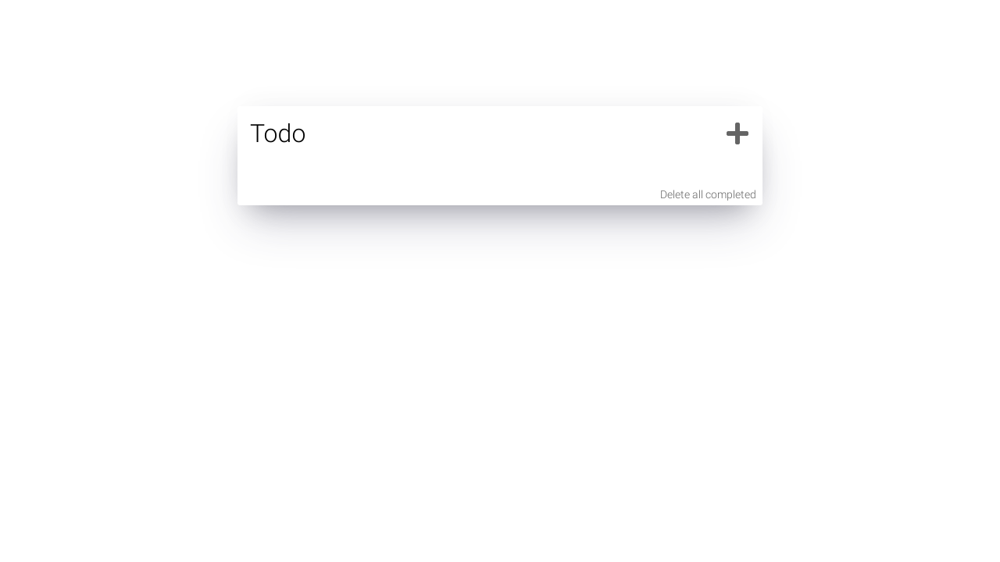

# React Todo
### [Live Site on Heroku](https://serdarsen-react-todo.herokuapp.com/)

## Introduction
React Todo is a demo app managing todos.

### Feature

- Ability to manage todos (add, delete, toggle status).
- Responsive Design.
- Ability to keep data on web storage.
- Built with Webpack.

## Usage
run `npm run dev`, browse `localhost:8080`

## Reference
- [Webpack](https://webpack.js.org/)
- [Heroku](https://devcenter.heroku.com/categories/deployment)
- [ESLint](https://eslint.org/)
- [React Icons](https://react-icons.github.io/react-icons/icons?name=fa)
- [Animista](https://animista.net/)